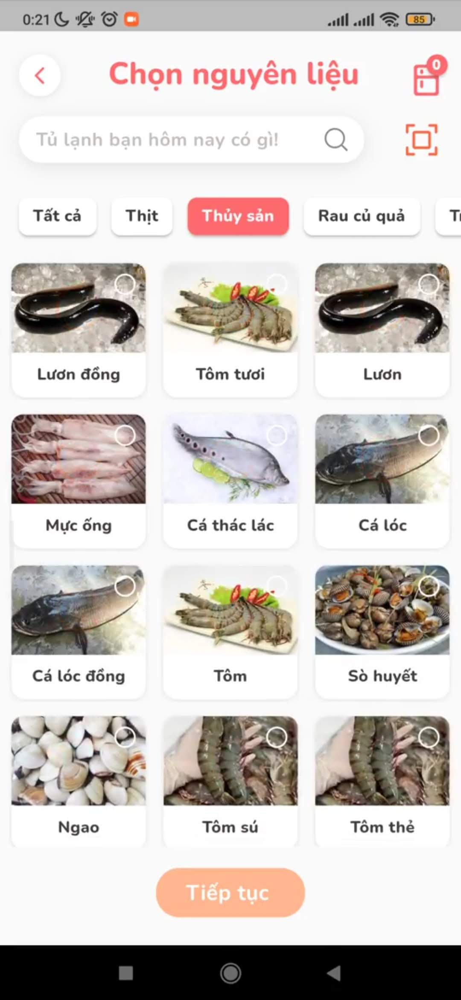

# SmartFood - Application suggesting recipes from available ingredients

[](https://flutter.dev/) 

<a href ="https://drive.google.com/file/d/1r5BxLCoTn2JqQuEjAtoUxmZeSHIByEKa/view?usp=sharing"></a>

## Features

- Choose available ingredients to find right recipes for you by your interests, region, diet, allergic food.
- Take pictures to detect available ingredients to find recipes for you. (in processing)
- Suggest recipes from leftovers to limit waste. (in processing)
- Personalized recipes suggestions. (in processing)
- Calculate the required calories according to your data. (in processing)
- Create own recipes. (in processing)
- Personal data management, favorite foods, diets.

## Technology used

- Flutter & Dart
- TensorFlow Lite
- Firebase
- NodeJs

## Environment

<details>
    <summary>Click to expand</summary>
    <br>

- Install nodejs
- Install npm or yarn
- Make sure you are in root directory

- Initiate commitlint with yarn

```bash
yarn
```

- Or with npm

```bash
npm i
```

</details>

## Setup and run

<details>
    <summary>Click to expand</summary>
    <br>

- Download APK
  - [APK - arm64](https://drive.google.com/file/d/1r5BxLCoTn2JqQuEjAtoUxmZeSHIByEKa/view?usp=sharing)
- Setup and run
  - Flutter
    - Install [Flutter](https://flutter.dev/docs/get-started/install).
    - Using **`stable`** channel:
      ```bash
      ❯ flutter channel stable
      ❯ flutter upgrade
      ```
    - Flutter doctor:
      ```bash
      ❯ flutter doctor
      ```
    - Install all the packages by:
      ```bash
      ❯ flutter pub get
      ```
    - Create .env file `assets/.env` has following structure:
      ```bash
      BASE_URL=https://api.smartfood.cooking/api
      ```
    - Run app on real devices or emulator by:
      ```bash
      ❯ flutter run
      ```
      or debug mode in VSCode or some IDEs

</details>

## Screenshots

|                                                |                                                |                                           |
| :--------------------------------------------: | :--------------------------------------------: | :---------------------------------------: |
|                 Splash Screen                  |                    Sign In                     |                Home Screen                |
|              |             |           |
|            Choose your Ingredients             |           Choose Ingrdients by Type            |               Choose recipe               |
|  |  |  |
|                 Cooking repice                 |                  Cooking step                  |               Done cooking                |
|             |        |   |

## Todo

- Implement features that are in processing.

## Contributors✨

<!-- ALL-CONTRIBUTORS-LIST:START - Do not remove or modify this section -->
<!-- prettier-ignore-start -->
<!-- markdownlint-disable -->
<table>
  <tr>
    <td align="center"><br /><sub><b>Nguyen Minh Dung</b></sub></a><br /><a href="https://github.com/dscdut/smartfood.cooking/commits?author=dungngminh" title="Code">💻</a> <a title="Mobile">📱</a> <a href="https://github.com/dscdut/smartfood.cooking/commits?author=dungngminh" >
    <td align="center"><br /><sub><b>Nguyen Minh Duc</b></sub></a><br /><a href="https://github.com/dscdut/smartfood.cooking/commits?author=beobiebom" title="Code">💻</a> <a title="Mobile">📱</a> <a href="https://github.com/dscdut/smartfood.cooking/commits?author=beobiebom" >
    <td align="center"><br /><sub><b>Hoang Quang Hung</b></sub></a><br /><a href="https://github.com/dscdut/smartfood.cooking/commits?author=H2Q318" title="Code">💻</a><a title="Backend">🔗</a> <a href="https://github.com/dscdut/smartfood.cooking/commits?author=H2Q318" >
    <td align="center"><br /><sub><b>Do Tran Binh</b></sub></a><br /><a href="https://github.com/dscdut/smartfood.cooking/commits?author=dtrbinh" title="Code">💻</a><a title="Mobile">📱</a> <a href="https://github.com/dscdut/smartfood.cooking/commits?author=dtrbinh" >
    <td align="center"><br /><sub><b>Nguyen Ich Hoa</b></sub></a><br /><a href="https://github.com/dscdut/smartfood.cooking/commits?author=ichhoa129" title="Code">💻</a><a title="Supporter">🤝</a><a title="Backend">🔗</a>  <a href="https://github.com/dscdut/smartfood.cooking/commits?author=ichhoa129" >
  </tr>
  
</table>

<!-- markdownlint-restore -->
<!-- prettier-ignore-end -->

<!-- ALL-CONTRIBUTORS-LIST:END -->
