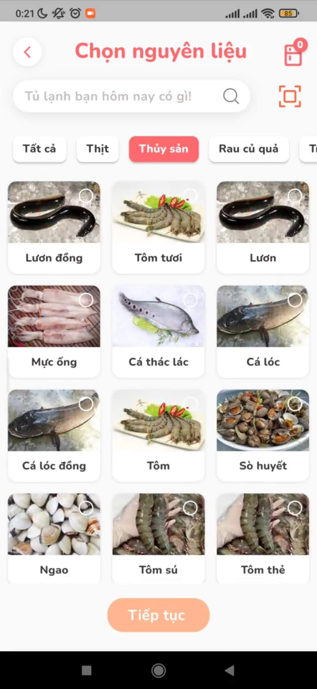

# SmartFood - Application suggesting recipes from available ingredients

[](https://flutter.dev/)

<a href ="https://drive.google.com/file/d/1r5BxLCoTn2JqQuEjAtoUxmZeSHIByEKa/view?usp=sharing"></a>

## Features

- Choose available ingredients to find right recipes for you by your interests, region, diet, allergic food.
- Take pictures to detect available ingredients to find recipes for you. (in processing)
- Suggest recipes from leftovers to limit waste. (in processing)
- Personalized recipes suggestions. (in processing)
- Calculate the required calories according to your data. (in processing)
- Create own recipes. (in processing)
- Personal data management, favorite foods, diets.

## Technology used

- Flutter & Dart
- TensorFlow Lite
- Firebase
- State management using <a href="https://pub.dev/packages/provider">Provider/ChangeNotifier</a>, Dependency Injection using <a href="https://pub.dev/packages/get_it">get_it</a>
- <a href="https://pub.dev/packages/hive">Hive</a> for local storage

## Directory structure

```
project
│   README.md
│
│
└───lib
│   |
|   |
|   └───src
|   |    │
│   |    └───core <--[app configs, constant, helpers, theme, utils]
|   |    |
│   |    └───data
│   |    |    |
│   │    |    └───datasource <-[Provider data from remote,  local storage and firebase]
│   |    |    |
│   │    |    └───models
│   |    |    |
│   │    |    └───repositories
│   |    |
|   |    |
│   |    └───di <-[Dependency Injection]
|   |    |
|   |    |
│   |    └───modules <-[App features, screens, business logic, local widgets]
│   |    |
│   │    |
│   |    └───widgets <-[Common widgets]
│   │    |
│   |    └───app.dart
│   |
│   └───main.dart
│
│
└───assets
        └───icons
        |
        └───images
        |
        └───fonts
        |
        └───.env <-[.env for environment]
```

## Setup and run

<details>
    <summary>Click to expand</summary>
    <br>

- Download APK
  - [APK - arm64](https://drive.google.com/file/d/1r5BxLCoTn2JqQuEjAtoUxmZeSHIByEKa/view?usp=sharing)
- Setup and run
  - Flutter
    - Install [Flutter](https://flutter.dev/docs/get-started/install).
    - Using **`stable`** channel:
      ```bash
      ❯ flutter channel stable
      ❯ flutter upgrade
      ```
    - Flutter doctor:
      ```bash
      ❯ flutter doctor
      ```
    - Install all the packages by:
      ```bash
      ❯ flutter pub get
      ```
    - Create .env file `assets/.env` has following structure:
      ```bash
      BASE_URL=https://api.smartfood.cooking/api
      ```
    - Run app on real devices or emulator by:
      ```bash
      ❯ flutter run
      ```
      or debug mode in VSCode or some IDEs

</details>

## Screenshots

|                                         |                                         |                                    |
| :-------------------------------------: | :-------------------------------------: | :--------------------------------: |
|              Splash Screen              |                 Sign In                 |            Home Screen             |
|              |             |           |
|         Choose your Ingredients         |        Choose Ingrdients by Type        |           Choose recipe            |
|  |  |  |
|             Cooking repice              |              Cooking step               |            Done cooking            |
|             |        |   |

## Todo

- Implement features that are in processing.

## Mobile App Contributors✨

<!-- ALL-CONTRIBUTORS-LIST:START - Do not remove or modify this section -->
<!-- prettier-ignore-start -->
<!-- markdownlint-disable -->
<table>
  <tr>
    <td align="center"><br /><sub><b>Nguyen Minh Dung</b></sub></a><br /><a href="https://github.com/dscdut/smartfood.cooking/commits?author=dungngminh" title="Code">💻</a> <a href="https://github.com/dscdut/smartfood.cooking/commits?author=dungngminh" >
    <td align="center"><br /><sub><b>Nguyen Minh Duc</b></sub></a><br /><a href="https://github.com/dscdut/smartfood.cooking/commits?author=beobiebom" title="Code">💻</a> <a href="https://github.com/dscdut/smartfood.cooking/commits?author=beobiebom" >
    <td align="center"><br /><sub><b>Do Tran Binh</b></sub></a><br /><a href="https://github.com/dscdut/smartfood.cooking/commits?author=dtrbinh" title="Code">💻</a> <a href="https://github.com/dscdut/smartfood.cooking/commits?author=dtrbinh" >
  </tr>
  
</table>

<!-- markdownlint-restore -->
<!-- prettier-ignore-end -->

<!-- ALL-CONTRIBUTORS-LIST:END -->
